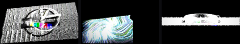
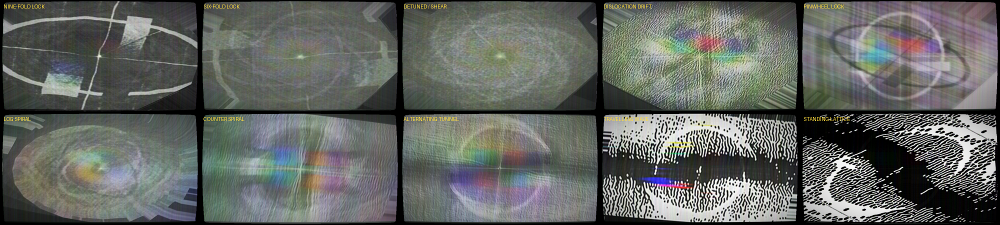
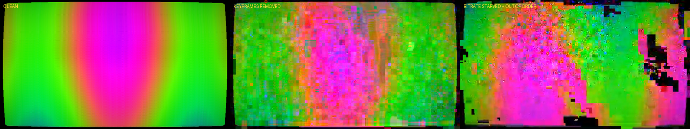
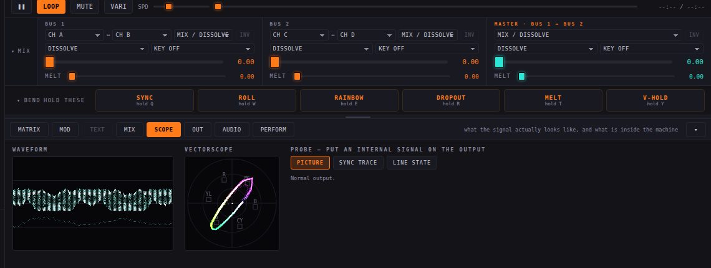
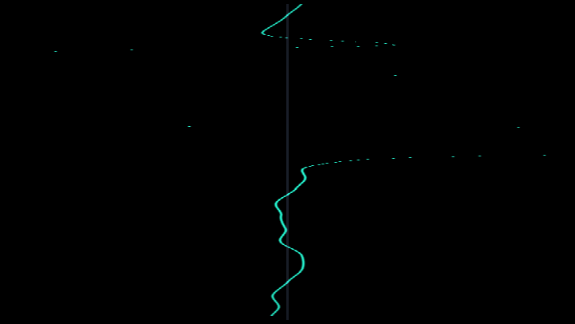

# BENDR

**A circuit-bent video processor that runs in your browser.**

**▶ Live: [bendr.allmyfriendsaresynths.com](https://bendr.allmyfriendsaresynths.com)**

BENDR emulates the analogue glitch aesthetic of circuit-bent video hardware: bent video enhancers, dying VHS decks, unstable sync circuits, and rescan feedback rigs — plus a digital corruption stage for pixel sorting, databending and datamoshing. Feed it video and abuse the signal path in real time.

Everything is a single self-contained HTML file. No server, no dependencies, nothing leaves your machine — video files stream from disk, so a 4GB MP4 works as well as a 4MB one. Chrome recommended.

The panel is in three zones: **CHANNEL · SIGNAL PATH** in the middle in the order the signal actually travels, then **MASTER OUT** and **TOOLS**. Only the channel zone reorders — drag by the handle, or press FOLLOW CHAIN to re-sort it to match the stage order on the rail. The mod matrix, modulation page and text editor live in a resizable dock under the picture rather than in pop-up panels, so the output stays visible while you patch. Every parameter, section, mode button and pad carries a hover description explaining what it does and why it behaves that way; any single control resets with a double-click.

Works on phones and tablets too: the picture stays pinned at the top, controls / bend pads / mod matrix live behind a bottom tab bar, sliders and pads are touch-sized, and the signal chain reorders with tap arrows instead of drag.


## Four channels, three buses

BENDR is a four-channel mixer. **A**, **B**, **C** and **D** each have their own input *and* their own complete set of effects — four sources, four glitch chains, four decks, running at once. The big A / B / C / D buttons at the top of the panel choose which channel you're editing; LINK edits all four; the selector beside it picks a target channel, and COPY writes this channel's effects onto it while SWAP exchanges the two outright, sources included. Any channel reaches any other, and shift-clicking COPY sends it to all three at once.

The channels meet in three mixers, laid out as a strip directly under the picture: bus 1, bus 2, and a master crossfade between them, each with the same twenty transitions. Each bus picks its own two inputs, so the pairings are not fixed: bus 1 can mix A against C, bus 2 can mix D against B. The faders sit under the picture rather than in the sidebar because a crossfader wants to be horizontal and is the one control you ride while looking at something else; the detail behind each transition lives on the MIX tab of the dock. To get all four in at once, set both bus faders part-way and put the master on ADD, SCREEN or LIGHTEN so the buses sum instead of crossfading. Everything downstream (display, overlay, morph) is shared. Leave the master fader at zero and channels C and D never render, so a two-channel setup costs exactly what it always did.

**MULTI** shows all four channel outputs, bus 1 and the programme at once, like a vision mixer's preview monitors.


## Re-entry

Any channel can take another channel, either bus, or the finished programme as its source. Process it and mix it back in and the feedback loop travels through the whole rig rather than round a single stage — the software equivalent of patching a mixer's output back into a spare input. Whatever it reads is one frame old, which is what keeps it stable.


## The melting edge

A hard boundary between two pictures is the thing that gives a digital mixer away. Every bus has a fourth stage after the transition, the mix type and the key, and it exists only to destroy that boundary.

It works by asking where the boundary actually is. The coverage matte is evaluated at four points a chosen distance from each pixel; where those four disagree, the pixel is standing on the edge, and the direction in which they disagree is the way the edge faces. That gives a band of controlled width with a normal running through it, and everything else follows: the incoming picture is dragged out along that normal so the seam smears, and the mixer's own previous frame is dissolved back in inside the same band. Because the band feeds itself, the smear does not wash out — it stays put, and creeps a little further out every frame until the band runs out of width.

The controls are MELT (how hard), WIDTH (how far either side), HOLD (how much of the last frame survives, which is the persistence that turns a smear into a trail), SWIRL (turns the drag from across the boundary to along it, so the edge stirs rather than bleeds), CHROMA (lets colour run further than brightness, the way it does off a composite edge) and CREEP (which side of the seam the melt lives on). Wind CREEP up and the melt only happens on the outgoing side, so a keyed or wiped shape bleeds into the background while the background never eats into the shape.


The amount rides next to each crossfader because it is a performance control; the rest sits on the MIX tab. At zero the stage is switched off and the history buffer is never touched, so it costs nothing when it is not in use. It works on all three buses independently, and on any transition or key that has an edge — a wipe, a luma or chroma key, a subscreen. A plain dissolve has no boundary, so nothing happens, which is correct.

## The dirty mixer

Every bus has a fault stage, and it is a fault rather than an effect. Hardware that has been dropped, or had a crossbar chip lifted, does not degrade smoothly: it fires. So this runs on an event clock. DIRT decides how often a firing happens, RATE how fast the clock runs, and four controls decide what a firing does — DROPOUT drops bands of lines through to the other side of the crossbar or to nothing at all, CUT throws the whole mix to one input regardless of where the fader is, KNOCK shoves the timebase sideways so the picture shears down the frame and crawls back, and NOISE sprays the switching transient across the picture with the colour dropping out as it hits. Between firings it is completely clean, which is the part that makes it read as a broken machine instead of a filter.


## Keying, borders and mix types

The keyer has the levels a bench mixer has: THRESH and SOFT set where the matte turns over, GAIN sets how hard it turns, DENSITY sets how opaque it is ever allowed to get. KEY BORDER grows the matte outward and fills the growth with one of the eight standard back colours; KEY SHADOW offsets a darkened copy underneath. Those are the outline and drop-shadow treatments that stop a title disappearing into a busy background, and they work on any key, not just text.

Wipes get the same treatment. BORDER WIPE lays a coloured rule along the join that follows the wipe wherever it goes, and WIPE MULTI tiles the whole pattern four or sixteen times — on every pattern, not a chosen few.

There are twenty-four mix types: dissolve, additive, non-additive, difference, multiply and screen, then darken, exclusion, subtract, overlay, hard/soft/vivid/pin light, colour dodge and burn, divide, wrap-add, bitwise XOR and AND, and hue, saturation, colour and luminosity. The first six keep the index they always had, so old patches load with the mix type they were saved with.


## What it is watched through

The output overlay is not a set of filters on the signal; it is everything between the picture and the eye, in the order light actually meets it. First the lens: barrel or pincushion distortion applied before anything is sampled, transverse chromatic aberration that grows towards the corners, and the horizontal anamorphic streak that a coated element throws off a highlight. Then the glass in front of the screen: smears that are only visible where something bright is behind them, reflections, dust, scratches, and light leaking past the felt to fog one side of the frame. Then the panel itself — an LCD subpixel lattice, and dead or stuck pixels that never move, which is what makes them read as a fault in the display rather than noise in the signal. There is a gate weave and a hair in the gate for the projector case.

Last, over everything, the deck's own display: a transport symbol, a tape counter that runs forward on play, seven times as fast on the shuttles and backwards on rewind, and an optional date stamp, in the dot-matrix yellow every camcorder used. It is drawn on a canvas rather than in the shader because it is type, and type wants a font.


## The scan processor

Every other stage here is a fragment shader: one output pixel from one input pixel. This one is not, and it cannot be.

A scan processor intercepts a monitor's deflection signals before the yoke and patches video luminance into the vertical position control, so bright parts of the picture physically pull the scan line up the tube. A camera then re-shoots the tube. The apparent depth is an artefact of photographing a two-dimensional deflection, not a model of a scene.

The part that matters is that the result is *drawn* rather than sampled. It is a stack of continuous glowing lines, and where those lines bunch you get a bright caustic ridge, where they splay you get a dark gap. A fragment shader has no notion of line density, so a displacement map cannot produce that — which is why most digital versions get the geometry and miss the physics.

So it is real geometry: one instanced line strip per scanline, expanded to a ribbon in the vertex shader because `gl.lineWidth` is clamped to 1 on essentially every desktop platform, with no vertex buffers at all — position comes from `gl_VertexID` and `gl_InstanceID`, and luminance is fetched in the vertex shader. It accumulates additively into a float target, and the beam brightens where it sweeps slower, because a slower beam deposits more energy per unit length. That last term is most of the difference between this and a displacement modifier.

On top of the displacement sit the raster operations you get by bolting extra deflection yokes onto a receiver and driving them yourself: sweep and field reversal (the scan order genuinely reverses, so it composes with everything downstream), S-curve and skew from a continuous-wind yoke, raster collapse that removes the vertical deflection entirely and smears the whole frame onto one line, and a deflection oscillator that can be locked to a multiple of the field rate — locked it stands still, detuned it crawls, and that crawl is the characteristic gesture of the instrument.



## Signal chain

The rail above the picture is the live signal path. **Drag the pills to reorder the stages, click one to bypass it.** Order changes everything: melting before the tape stage smears clean video and then damages it; melting after smears the damage itself.

```
per channel (A B C D):  INPUT → framing → FEEDBACK / RESCAN → frame store
                          → [ TAPE/SYNC · COLOUR/ENH · GLITCH LAB · SIGNAL LAB
                              · FLOW/MOSH · SCAN · BLOCK · TIME ]  ← reorderable
                  A + B:  → MIX BUS 1 ┐
                  C + D:  → MIX BUS 2 ┴→ MASTER MIX
                          → FIELDS → MASTER OUTPUT → CODEC MOSH → OVERLAY
```

- **Tape / sync** — a per-scanline PLL simulation runs on the CPU every frame, once per channel: correlated drift, loss-of-lock shear with exponential re-lock, a drifting tracking band, head-switch skew, AGC breathing, a rolling blanking bar when v-hold slips. Composite rot on top: chroma bleed and delay, directional luma bleed, vertical colour bleed, rainbow fringing, dot crawl, ringing, streaky bandwidth-limited noise, comet-tail dropouts.
- **Tape transport** — a whole deck per channel. The transport row drives that channel's source: still parks the noise bar a paused deck lays across the field, shuttle and jog scrub with head-crossing bands marching through the picture. Tape speed runs SP to EP, so the slower the tape the less bandwidth survives; generations compounds gen loss as if the tape had been dubbed that many times; track phase places the mistracking band and servo hunt sets the auto-tracking circuit searching for it. Then tape crease, head clog, azimuth error, scrape flutter, wow with its own rate, tape stretch, edge damage, print-through, chroma loss, hiss, and dropout with adjustable streak length.


- **Mixer effects** — negative with three inversion modes, monocolour, colourpass (one hue survives, the rest goes monochrome), silhouette, find-edge, emboss, flip, mirror, multi-grid tiling, still, strobe and shake.
- **Colour / bent enhancer** — luma-keyed rainbow colorizer, a sharpness circuit driven into oscillating edge ghosts, RGB split, luma→hue slew, flickering inversion, per-channel RGB gain, posterize, solarize.
- **Contour / palette** — draws the isolines between brightness bands, giving the repeated outlines that trace a face or a body the way a bent enhancer does; plus FLATTEN to quantise brightness into solid poster-like colour fields, and DITHER to break the steps into speckle.
- **Kaleido** — folds the picture into radial symmetry; FOLD N = 3 gives triangles, and modulating FOLD SPIN rotates the whole composition.
- **CRT rephoto** — bloom, film-style halation, glass defocus and grain, for the look of a photograph *of* a screen rather than a clean render.
- **Glitch lab** — pixel sorting (bright runs stretch into streaks), macroblock databending, halftone dropout, channel-driven drift warp, FM contour warp.
- **Flow / mosh** — a temporal-smear stage with its own frame store, advected along a selectable vector field: real per-pixel optical flow estimated from the picture, brightness contours, curl noise, radial, spiral, chroma, weave. P-frame push drags the held frame along that field, which on the motion setting is what datamosh actually is — the picture stops updating while the movement keeps pulling it apart. Mosh gate restricts the holding to the moving parts of the frame or to the still parts; curl rotates the whole field so drift becomes orbit. Plus melt with its own angle and brightness gate, swirl with scale and speed, vector trash with block size and rate, stretch, edge repel, flow noise, per-pass hue and decay, re-sharpening, time shear on either axis, and clamp / repeat / mirror edges.
- **Feedback / rescan** — a full feedback rig: zoom, rotate, shear, offset and mirror in the loop, edge mode (clamp for tunnels, repeat for lattices, mirror for mandalas), per-pass colour rotation, saturation, value gain and per-channel RGB gain, chromatic displacement, blur plus sharpen (an activator–inhibitor pair that grows Turing patterns), a four-way non-linearity (clamp / soft / wrap / fold) with drive and pivot, threshold, loop noise, vertical roll, sync jitter and an auto-level servo. a sign switch on either axis (a reflection, which no rotation can reach, and the thing that turns a rotating tunnel into an alternating one), RESCAN: FULL feeds the display output back through the entire chain. Forty presets prefixed **FB** are named after the looks they produce, ten of them laid out along the classic phase diagram: set the rotation to a whole fraction of a turn and the picture locks into that many arms, detune it slightly and the arms shear past each other, add the reflection and you get pinwheels and travelling waves.
- **Signal lab** — sparse line jitter, NTSC crosstalk with separate artifact and fringing controls, shaped snow with clumping, FM wobble, slitscan, row smear, 1-bit crush with ordered dither, moiré, a multi-band sequential keyer, and field modulation that varies across the frame rather than per-frame.
- **Block transform** — a real separable 8-point DCT and inverse, two passes, one per axis. Quantise the coefficients and the picture comes back as a lossy codec would give it back: ringing round every edge, whole blocks flattened to their average, chroma crushed harder than luma because that is what a codec does first. The HF penalty tilts the quantiser toward the high frequencies, which is the difference between a soft picture and a blocky one.
- **Time displace** — every other stage samples the current frame at a different place; this one samples a different frame at the same place. A twelve-frame ring of the picture is held in a texture array and each pixel chooses how far back to look, from a vertical ramp (slit-scan), a horizontal sweep, the picture's own brightness (bright things lag behind dark ones), a radial push, or the per-line ramp a time-base corrector produces as it fails. Interpolate off gives visible time-quantised bands.
- **PNG avalanche** — filtered-image corruption rather than block corruption. A row's prediction filter is changed after the fact, so the error propagates down through every row that referenced it and the picture tears into a diagonal cascade that heals only where a run is contained.
- **Keyer** — luma or chroma key with a matte viewer; masks the glitch chain and/or the feedback.
- **Mixers** — three of them (bus 1, bus 2, master), each combining two fully-processed inputs: a fader plus twelve wipe patterns (H, V, diagonal, box, circle, splits, blinds, clock, bars, blocks) with soft edges and movable origin, key transitions, and add/difference/multiply/screen/lighten blends.
- **Preset morph** — snapshot two whole panel states and blend every slider between them.
- **Fields** — interlace, applied to the master output where it belongs rather than inside a channel. Video was never frames: it is two half-height pictures sampled a fiftieth of a second apart and combed together. WEAVE interleaves them so anything that moved between them serrates; BOB shows one field and fills the gaps, so the picture jitters by half a line at field rate; BLEND averages them and ghosts everything that moves. Swapping the field order is a fault, and it produces the stuttering backward-and-forward motion that is instantly recognisable and almost impossible to fake any other way. Plus line twitter on high vertical detail and 3:2 telecine judder.
- **Codec mosh** — an actual encoder and decoder wired back to back with the bitstream broken in between. A keyframe is a whole picture; everything between it is only the difference from the frame before, carried mostly as motion vectors. Throw the keyframes away and the decoder never gets a new picture, so it keeps applying new movement to an old one — the motion of the current shot paints itself onto a picture from before the cut. On top of the key removal: differences held and re-applied, dropped, and re-injected out of order from a couple of seconds back; a real quantiser starved of bitrate; and a resync control that lets a keyframe through every so often so the picture snaps back to reality and starts falling apart again. Nothing here is a shader imitating a codec, so the artefacts are the decoder's own. It costs a frame or two of delay, and the decoder will occasionally give up and re-acquire, which is visible and is meant to be.
- **Master output** — a display stage rather than a filter: seven display models (flat, aperture grille, slot mask, shadow mask, LCD stripe, mono monitor, green screen) with beam-profile scanlines that widen with brightness, phosphor persistence, HV sag, bloom, halation, defocus, grain, and a full output transform. Plus an overlay stage: letterbox and pillarbox mattes, bezel, glass glare, dust, scratches, screen moiré, rolling shutter and safe-area guides.

|  |  |  |
|---|---|---|
| DATAMOSH | DOT MATRIX | LIQUID MELT |

|  |  |  |
|---|---|---|
| VOL I — ENHANCER LINES | TRIANGLES | CRT REPHOTO |



*The same loop, ten settings of four numbers: rotation, scale, reflection, gain.*



*Clean, then the same picture with the keyframes removed, then starved of bitrate with the differences arriving out of order.*

Presets named after the glitch art series on [allmyfriendsarejpegs.com](https://allmyfriendsarejpegs.com): VOL I / II / III, TRIANGLES, 80S TRIANGLE, BLADE RUNNER TRIANGLE, CRT REPHOTO and JPEGS.

## Pattern synth

Any channel can be a generator rather than a player. It is built like a video synthesiser: coordinates go through a shape (scan, radial, spiral, plasma, lissajous, rings, starburst, grid, tunnel, cells, interference, polygon), then an oscillator with a selectable waveform, then cross-modulation between the axes, a wavefolder, a comparator, and a colouriser — mono, RGB phase, HSV sweep, duotone or hard bands. It runs entirely on the GPU and every control is a modulation destination, so patching an LFO into CROSS MOD turns it into a moving source with no file involved.


## Snapshots and the performance recorder

The dock under the picture has eight tabs — mod matrix, modulation page, text editor, mix (the transition detail), scope (the monitoring), out (the display, fields and codec stages, all of them shared by every channel), audio, and perform, which holds the snapshot bank, the recorder and the bend pads together. Eight snapshot slots hold the whole rig — all four channels, every bus, every mode — with a **glide** time. At zero a recall is a hard cut; wound up it becomes a slow transformation of everything at once.

The **performance recorder** writes down every control you move, twenty-four times a second, storing only what changed. It records gestures rather than pixels, so a take built slowly over an hour can be played back in real time, against completely different footage. Takes are saved inside the patch file.

## Text and shapes

Any channel can be a text/shape generator instead of a video source: type anything, choose from thirty-three fonts, set size, tracking, position, rotation, scroll and repeat, add an outline, and layer a shape underneath (circle, ring, rect, triangle, cross, bars, grid, concentric rings, starburst) with count, spin, stroke and pulse. It behaves exactly like any other source, so it can be glitched, fed back and mixed against video on the other channel.


## Inputs

Each channel takes a video file (streamed from disk, so a 4GB file is no heavier than a small one), a camera, a screen, a generated pattern, the pattern synth, a text page, or re-entry from elsewhere in the rig.

**CAM** opens whatever is selected in the device list beside it, so a built-in webcam, a USB one, an HDMI capture stick and a virtual camera from streaming software all work the same way. Device names only appear once camera access has been granted, so the list reads DEVICE 1, DEVICE 2 until the first time CAM is pressed. **SCREEN** captures a screen, a window or a browser tab, which is the general way to bring in anything that is not a camera.

The interface follows what the source can actually do. A file has a timeline, so it plays, loops, seeks, mutes and shuttles. A generated source — pattern, text, synth, or a feed from another channel — has a clock but nothing to scrub, so SPD and the deck transport drive that clock while the file controls grey out. A camera or screen capture has neither: it can be held or let run and nothing else, because asking a live stream to seek does not fail quietly, it throws. The panel obeys the same rule, so PATTERN SYNTH only appears on a channel that is actually a synth.

Channel thumbnails stay current whether or not the channel is in the mix. An idle channel is not rendered at all, so one of them per tick has its source pulled for the thumbnail, which is how you can see what is loaded on C and D before you fade them up.

## The panel, the dock and the picture

The sidebar is per-channel, and only per-channel: everything shared by all four — the three mixers, the display stage and the output overlay — is on a tab in the dock under the picture. Each stage section carries its own bypass, wired to the same state as the rail above the picture, so switching TAPE / SYNC out of the chain reads the same in both places. The dock folds away entirely with the button on its tab strip or a double-click on the bar above it, and both the folded state and the height you drag it to are remembered.

Each channel button carries a live thumbnail of what that channel is producing and the name of what is loaded on it, so you can tell at a glance what is where. The tempo has a beat LED beside it that flashes on the beat and accents the bar, because a number is not something you can check against music.

## Letting it fail

Two switches exist so the models can reach states they cannot get out of, because a model that always recovers is a model that cannot actually break.

**LOCK: LATCHED** stops the sync PLL re-acquiring. Normally a loss of lock shears the picture and the loop pulls itself back over the next few hundred milliseconds, because that is what a working circuit does. Latched, every shear stays where it happened and the next one lands on top of it. Switching it back unwinds the whole accumulated mess at once.

**SERVO: DEFEATED** removes the feedback auto-level safety net, so the loop is free to run away to white or collapse to black and stay there — which is what a feedback rig with no operator actually does.

The phosphor persistence is also a real accumulator now, with separate decay per primary. Green P22 is the slowest and blue the fastest, which is why fast movement on a tube leaves a green-tinted wake with a blue leading edge rather than a grey smear.

## Watching the signal

The SCOPE tab is a monitoring bay rather than a decoration. The **waveform monitor** plots luminance against horizontal position for the whole frame, with graticule lines at black and white, so you can see clipping and crushed blacks that the picture itself hides. The **vectorscope** plots the chroma of every sampled pixel on the U/V plane with the six colour-bar targets marked, so a hue rotation reads as the whole cloud turning and an over-saturated pass reads as it hitting the edge. Both read back the finished programme at low resolution ten times a second, and only while the tab is open, so they cost nothing when you are not looking.



**PROBE** puts an internal signal on the output instead of the picture. SYNC TRACE draws the sync model's own per-line horizontal displacement as a trace down the frame, which is the thing that produces the shear you can see but not measure. LINE STATE shows the AGC gain, the noise floor and the high-frequency loss for every line as three coloured bars. It is the difference between "the picture is doing something odd" and knowing which part of the model is doing it.



## Finding things, and not losing them

There are 404 parameters. Press `/` and type, and the panel narrows to whatever matches — the parameter's name, its section, or the body of its help text, so "roll" finds V ROLL and a phrase from a description finds the control it describes. Two chips beside the box answer the other two questions you have while playing: **MOVING** shows only what something is currently driving, and **CHANGED** shows only what you have moved off its default.

The six bend pads have their own strip beside the faders rather than living on a tab, because you should never have to go looking for them mid-set.

Right-clicking any parameter opens the modulation menu, and the sources in it say what they are already doing. Eight LFOs, three envelopes and the audio and video followers look identical in a list, so a source that already drives something is marked with its destination count and names them on hover, and one that drives nothing says FREE. Picking an unused modulator is a glance rather than a memory test.

The patch, the eight snapshots and the current take are written to the browser every few seconds, so a reload, a crash or a flat battery picks up where you left off. Press `Z` straight after opening if you would rather start clean.

## Movement

Nothing sits still. The mod matrix patches any source into any parameter:

- As many modulators as you want, of three kinds: **LFOs** (ten shapes, free or synced to twenty divisions including dotted and triplet), **envelopes** (fire and decay on a bend pad, an audio onset, a scene cut or the tempo) and **macros** (one knob driving as many parameters as you point it at)
- Chaos, drift and spike generators
- Audio bands with adjustable frequency ranges, gain and response, listening to the loaded video's soundtrack, a live input (with device and channel selection for interfaces), or an audio file loaded and played on the AUDIO tab — which is how you build a piece against the track it will be shown with
- Video-reactive sources computed from the picture itself: motion, brightness, and scene-cut detection — patch CUT into TEAR and every edit knocks the sync loose

Every route has its own invert and response curve, so one source can push one parameter up while easing another down. The matrix links both ways: a route jumps to its modulator, and a modulator lists what it drives and jumps back. **Right-click any parameter** to patch a modulator onto it directly. The **MOD** page (`D`) draws every source live — four LFOs with editable rate, ten shapes and tempo sync, chaos/drift/spike generators, audio bands and video-reactive sources — and shows what each one is driving.


Presets you build yourself save to the machine and sit in the preset list beside the built-in ones; patches also save as `.json` files to move between machines.

Six momentary bend pads (mouse, `Q W E R T Y`, or MIDI notes C1–F1), MIDI CC learn on every slider, per-section resets and a global init.

Randomize has a caret beside it that decides what a roll is allowed to touch, because all-or-nothing is the wrong granularity for building a mix. **THIS CHANNEL** rolls only the channel you are editing and leaves the other three alone; **ALL FOUR** rolls each of them separately, so they come out different from each other rather than four copies of one; **FOLLOW LINK** is the old behaviour. Under KEEP, **SOURCE** holds the pattern synth and the framing still, so whatever you have loaded or built survives and only the processing changes; **MODULATION** holds the routes and the LFOs, so the movement you set up keeps running against new parameters; **OUTPUT + CHAIN** holds the mixer, the display, the overlay and the stage order. Randomizing one channel no longer unpatches another: only the routes belonging to the channels being rolled are replaced. MUTATE obeys the same settings, everything is undoable, and the choices are remembered between sessions.

The tempo can be typed as well as tapped. Click the number beside TAP and type it; Enter commits, Escape reverts, and the arrow keys nudge by a beat, or a tenth with shift. An incoming MIDI clock will not overwrite the field while you are editing it.

## Output

- Processing resolution from 360p to **4K**, independent of window size
- **FLUSH BUFFERS** empties every self-feeding buffer (feedback, flow, persistence, frame ring) without disturbing the patch
- Live **recording** with source audio, MP4 where the browser supports it and WebM otherwise
- Frame-accurate **offline MP4 render** via WebCodecs — every frame processed at full quality regardless of realtime performance (video only)
- PNG stills, fullscreen, and a clean **pop-out output window** for OBS capture or a second display

## Keys

`/` filter the panel · `Space` randomize · `M` mutate · `Z` undo · `shift`+`Z` redo · `1–9` presets · `shift`+`1–8` snapshots · `0` flush buffers · `Q W E R T Y` hold bends · `B` bypass · `V` multiview · `F` fullscreen · `S` still · `shift`+`R` record · `P` play/pause · `D` mod page · `H` help

`0` is the panic key: it empties every buffer that feeds itself — the feedback store, the flow stage, the phosphor persistence and the frame ring — without touching a single control. That is the way out when a bad frame gets caught circulating.

## Development

Source lives in `src/` as ten parts plus a vendored MP4 muxer. They are concatenated, in order, into a single `<script>`, which is what lets a later part use a `const` from an earlier one with no imports, no bundler and no module loader — and is why the file still runs from `file://` with the network off.

| part | what is in it |
|---|---|
| `p1_shell.html` | markup, all the CSS, the help overlay |
| `p20_shaders.js` | GLSL source strings, nothing else |
| `p21_params.js` | section table, parameter registry, get/set |
| `p22_help.js` | per-parameter and per-section help text |
| `p23_gl.js` | context, programs, render targets, uniforms |
| `p3_mod_ui.js` | modulation engine, audio, panel and dock construction |
| `p40_presets.js` | presets, state capture and restore, undo |
| `p41_sources.js` | file, camera, screen, pattern, text, synth, re-entry |
| `p42_capture.js` | recording, stills, multiview, snapshots, performance recorder |
| `p43_render.js` | sync model, render loop, deck display |
| `p44_offline.js` | offline MP4 render, MIDI, keyboard, init |

Build the single-file `index.html` with:

```
python3 build.py
```

The build syntax-checks the concatenated script, prints the version, the gzipped size and a hash, fails on a size budget, and prints where each part landed so a line number in a stack trace can be resolved by eye. The version lives in exactly one place, `BENDR_VERSION` at the top of `p21_params.js`, and is written into the header and the manual at boot; the build fails if it is missing.

Recording and the offline render both work at the **processing resolution**, not the window size, and the bitrate scales with the pixel rate — glitch material is close to the worst case an encoder ever sees.

`test/e2e-example.js` shows how the app is exercised headlessly with Playwright. Note that the canvas is created without `preserveDrawingBuffer`, so reading a frame back has to happen inside the frame callback: `await page.evaluate(() => window.__grab())` returns a data URL captured at the right moment.

## License

MIT.
