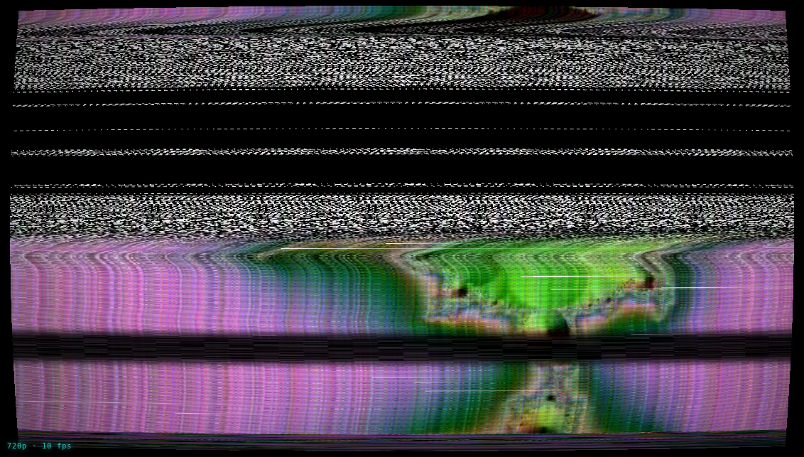
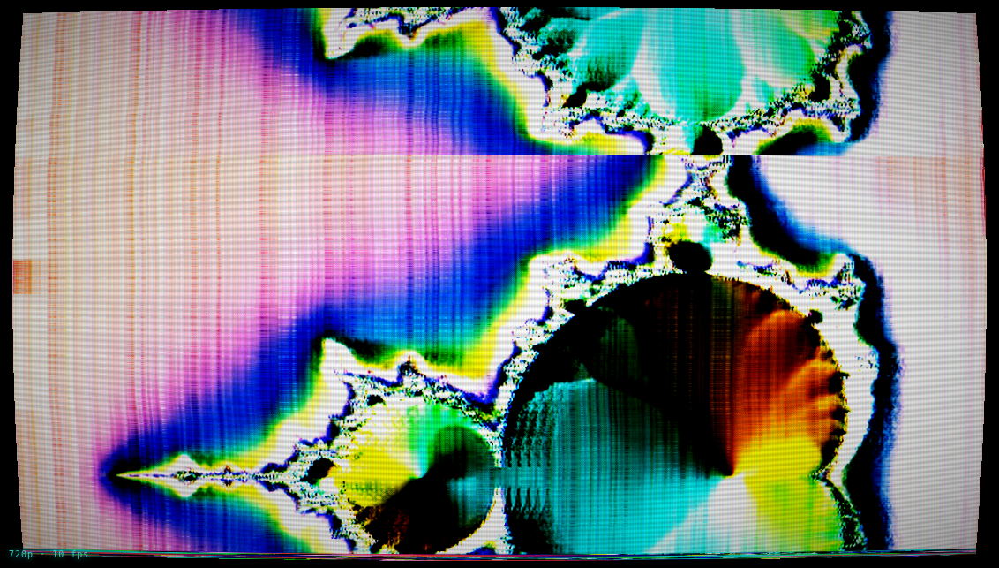

# BENDR

**A circuit-bent video processor that runs in your browser.**

**▶ Live: [bendr.allmyfriendsaresynths.com](https://bendr.allmyfriendsaresynths.com)**

BENDR emulates the analogue glitch aesthetic of circuit-bent video hardware: bent video enhancers, dying VHS decks, unstable sync circuits, and rescan feedback rigs. Feed it video and abuse the signal path in real time.

Everything is a single self-contained HTML file. No server, no dependencies, nothing leaves your machine — video files stream from disk, so a 4GB MP4 works as well as a 4MB one. Chrome recommended.


## Signal path

```
A/B mixer → frame position/zoom/rotate → feedback / rescan
  → frame store (echo · stutter)
  → tape & sync damage ⇄ bent enhancer & colour (CHAIN swaps the order)
  → keyer masks → CRT
```

- **Physical sync model** — a per-scanline PLL simulation runs on the CPU every frame: correlated drift, loss-of-lock shear with exponential re-lock, a drifting tracking band, head-switch skew, AGC breathing, and a rolling blanking bar when v-hold slips. No random rectangles.
- **Composite/NTSC rot** — chroma bleed & delay, directional luma bleed, vertical colour bleed, rainbow fringing on luma edges, dot crawl, ringing, bandwidth-limited streaky noise, comet-tail dropouts.
- **Bent enhancer** — luma-keyed rainbow colorizer, a sharpness circuit driven into oscillating edge ghosts, RGB split, luma→hue slew, flickering inversion, per-channel RGB gain.
- **Feedback / rescan** — zoom/rotate/hue-spin feedback; RESCAN: FULL feeds the CRT output (scanlines, curvature and all) back through the entire chain, like a camera pointed at a monitor.
- **Frame store** — echo from N frames back (modulate DELAY to time-scrub), stutter freeze.
- **Keyer** — luma or chroma key with threshold/softness/invert; masks the FX chain and/or feedback.
- **A/B mixer** — two video channels with fade / luma-key / chroma-key compositing, plus full-state MORPH between two stored panel snapshots.
- **Frame / position** — zoom, position, and rotate the picture inside the raster, with BLACK / TILE / MIRROR edge modes.

|  |  |
|---|---|
| DEAD DECK with the V-HOLD bend held | ENHANCER BURN |

## Movement

Nothing sits still. The mod matrix patches any source into any parameter:

- Four LFOs (sine/tri/saw/square/S&H), free-running or tempo-synced (tap tempo or MIDI clock)
- CHAOS, DRIFT and SPIKE generators
- Audio bands (bass/mid/high) with adjustable frequency ranges, gain, response, input device and channel selection for audio interfaces
- **Video-reactive sources** computed from the picture itself: MOTION, BRIGHT, and CUT — patch CUT→TEAR and every edit knocks the sync loose like a real deck

Six momentary bend pads (mouse, `Q W E R T Y`, or MIDI notes C1–F1), MIDI CC learn on every slider, randomize/mutate with undo.

## Output

- Live **WebM recording** with source audio
- Frame-accurate **offline MP4 render** via WebCodecs — every frame processed at full quality regardless of realtime performance (video only)
- PNG stills, fullscreen, and a clean **pop-out output window** for OBS capture or a second display (double-click it for fullscreen; the render loop is driven from whichever window is visible, so fullscreen output never freezes)

## Keys

`Space` randomize · `M` mutate · `Z` undo · `1–9` presets · `Q W E R T Y` hold bends · `B` bypass · `F` fullscreen · `S` snapshot · `R` record · `P` play/pause · `H` help

## Development

Source lives in `src/` as four parts (shell/CSS, GL engine + shaders, modulation + UI, I/O + main loop) plus the vendored [mp4-muxer](https://github.com/Vanilagy/mp4-muxer) (MIT). Build the single-file `index.html` with:

```
python3 build.py
```

`test/e2e-example.js` shows how the app is exercised headlessly with Playwright (load video, switch presets, record, render).

## License

MIT. Vendored mp4-muxer is MIT, © Vanilagy.
