# BENDR

**A circuit-bent video processor that runs in your browser.**

**▶ Live: [bendr.allmyfriendsaresynths.com](https://bendr.allmyfriendsaresynths.com)**

BENDR emulates the analogue glitch aesthetic of circuit-bent video hardware: bent video enhancers, dying VHS decks, unstable sync circuits, and rescan feedback rigs — plus a digital corruption stage for pixel sorting, databending and datamoshing. Feed it video and abuse the signal path in real time.

Everything is a single self-contained HTML file. No server, no dependencies, nothing leaves your machine — video files stream from disk, so a 4GB MP4 works as well as a 4MB one. Chrome recommended.

The panel is in three zones: **CHANNEL · SIGNAL PATH** in the middle in the order the signal actually travels, then **MASTER OUT** and **TOOLS**. Only the channel zone reorders — drag by the handle, or press FOLLOW CHAIN to re-sort it to match the stage order on the rail. The mod matrix, modulation page and text editor live in a resizable dock under the picture rather than in pop-up panels, so the output stays visible while you patch. Every parameter, section, mode button and pad carries a hover description explaining what it does and why it behaves that way; any single control resets with a double-click.

Works on phones and tablets too: the picture stays pinned at the top, controls / bend pads / mod matrix live behind a bottom tab bar, sliders and pads are touch-sized, and the signal chain reorders with tap arrows instead of drag.

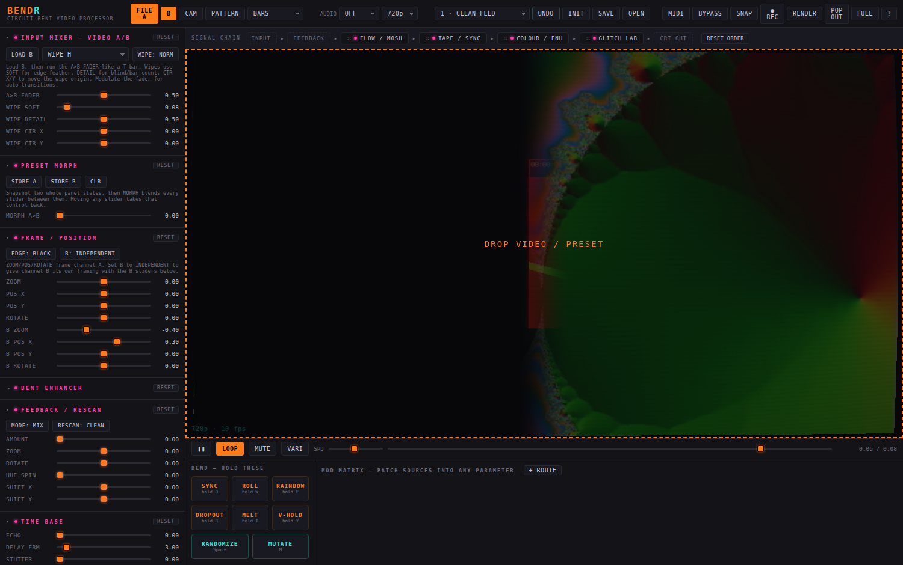

## Four channels, three buses

BENDR is a four-channel mixer. **A**, **B**, **C** and **D** each have their own input *and* their own complete set of effects — four sources, four glitch chains, four decks, running at once. The big A / B / C / D buttons at the top of the panel choose which channel you're editing; LINK edits all four; the selector beside it picks a target channel, and COPY writes this channel's effects onto it while SWAP exchanges the two outright, sources included. Any channel reaches any other, and shift-clicking COPY sends it to all three at once.

The channels meet in three mixers, laid out as a strip directly under the picture: bus 1, bus 2, and a master crossfade between them, each with the same twenty transitions. Each bus picks its own two inputs, so the pairings are not fixed: bus 1 can mix A against C, bus 2 can mix D against B. The faders sit under the picture rather than in the sidebar because a crossfader wants to be horizontal and is the one control you ride while looking at something else; the detail behind each transition lives on the MIX tab of the dock. To get all four in at once, set both bus faders part-way and put the master on ADD, SCREEN or LIGHTEN so the buses sum instead of crossfading. Everything downstream (display, overlay, morph) is shared. Leave the master fader at zero and channels C and D never render, so a two-channel setup costs exactly what it always did.

**MULTI** shows all four channel outputs, bus 1 and the programme at once, like a vision mixer's preview monitors.

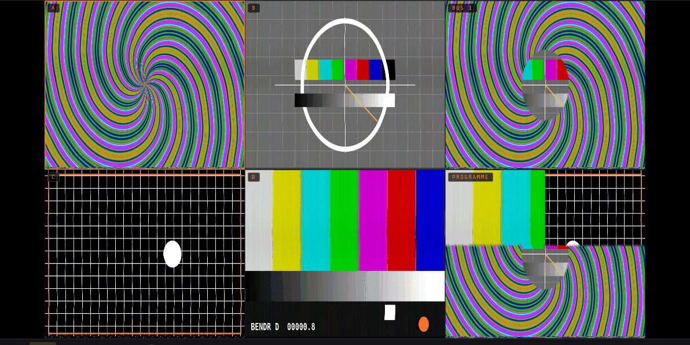

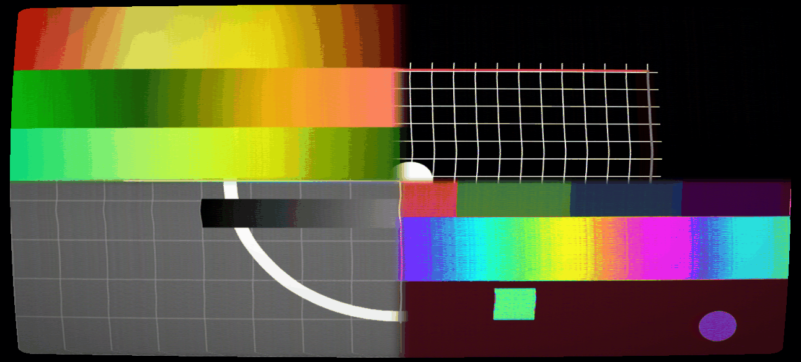

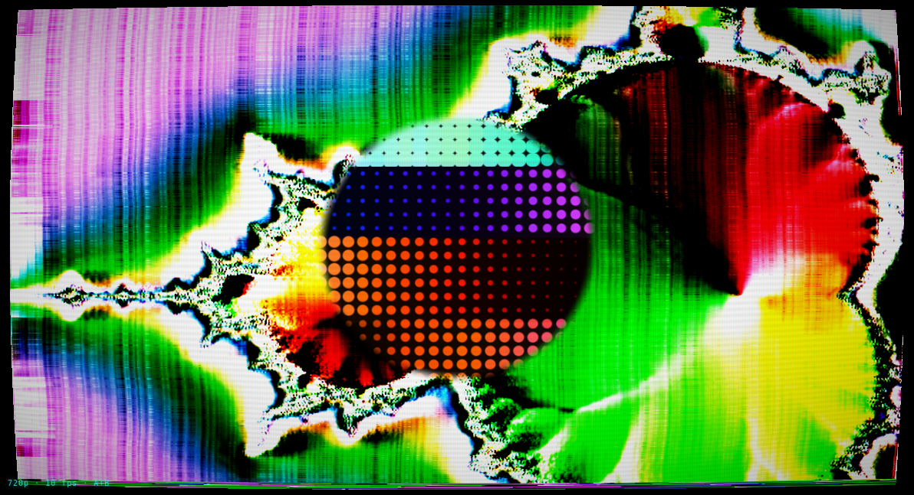

## Re-entry

Any channel can take another channel, either bus, or the finished programme as its source. Process it and mix it back in and the feedback loop travels through the whole rig rather than round a single stage — the software equivalent of patching a mixer's output back into a spare input. Whatever it reads is one frame old, which is what keeps it stable.

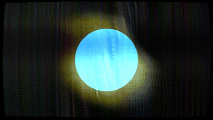

## The melting edge

A hard boundary between two pictures is the thing that gives a digital mixer away. Every bus has a fourth stage after the transition, the mix type and the key, and it exists only to destroy that boundary.

It works by asking where the boundary actually is. The coverage matte is evaluated at four points a chosen distance from each pixel; where those four disagree, the pixel is standing on the edge, and the direction in which they disagree is the way the edge faces. That gives a band of controlled width with a normal running through it, and everything else follows: the incoming picture is dragged out along that normal so the seam smears, and the mixer's own previous frame is dissolved back in inside the same band. Because the band feeds itself, the smear does not wash out — it stays put, and creeps a little further out every frame until the band runs out of width.

The controls are MELT (how hard), WIDTH (how far either side), HOLD (how much of the last frame survives, which is the persistence that turns a smear into a trail), SWIRL (turns the drag from across the boundary to along it, so the edge stirs rather than bleeds), CHROMA (lets colour run further than brightness, the way it does off a composite edge) and CREEP (which side of the seam the melt lives on). Wind CREEP up and the melt only happens on the outgoing side, so a keyed or wiped shape bleeds into the background while the background never eats into the shape.

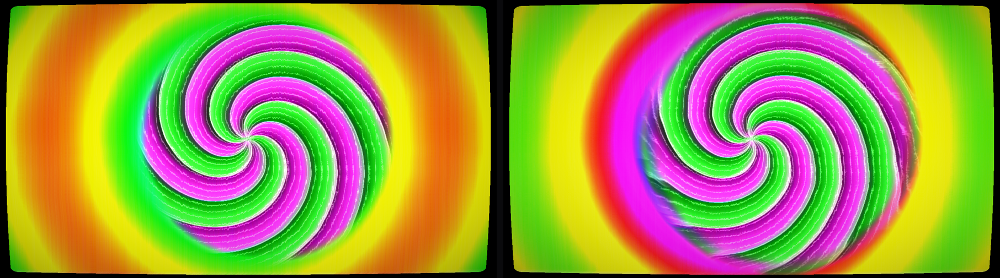

The amount rides next to each crossfader because it is a performance control; the rest sits on the MIX tab. At zero the stage is switched off and the history buffer is never touched, so it costs nothing when it is not in use. It works on all three buses independently, and on any transition or key that has an edge — a wipe, a luma or chroma key, a subscreen. A plain dissolve has no boundary, so nothing happens, which is correct.

## The dirty mixer

Every bus has a fault stage, and it is a fault rather than an effect. Hardware that has been dropped, or had a crossbar chip lifted, does not degrade smoothly: it fires. So this runs on an event clock. DIRT decides how often a firing happens, RATE how fast the clock runs, and four controls decide what a firing does — DROPOUT drops bands of lines through to the other side of the crossbar or to nothing at all, CUT throws the whole mix to one input regardless of where the fader is, KNOCK shoves the timebase sideways so the picture shears down the frame and crawls back, and NOISE sprays the switching transient across the picture with the colour dropping out as it hits. Between firings it is completely clean, which is the part that makes it read as a broken machine instead of a filter.

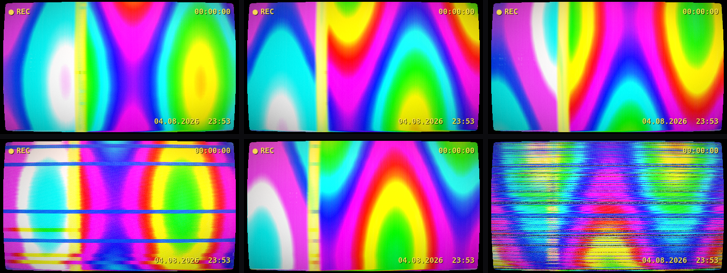

## Keying, borders and mix types

The keyer has the levels a bench mixer has: THRESH and SOFT set where the matte turns over, GAIN sets how hard it turns, DENSITY sets how opaque it is ever allowed to get. KEY BORDER grows the matte outward and fills the growth with one of the eight standard back colours; KEY SHADOW offsets a darkened copy underneath. Those are the outline and drop-shadow treatments that stop a title disappearing into a busy background, and they work on any key, not just text.

Wipes get the same treatment. BORDER WIPE lays a coloured rule along the join that follows the wipe wherever it goes, and WIPE MULTI tiles the whole pattern four or sixteen times — on every pattern, not a chosen few.

There are twenty-four mix types: dissolve, additive, non-additive, difference, multiply and screen, then darken, exclusion, subtract, overlay, hard/soft/vivid/pin light, colour dodge and burn, divide, wrap-add, bitwise XOR and AND, and hue, saturation, colour and luminosity. The first six keep the index they always had, so old patches load with the mix type they were saved with.

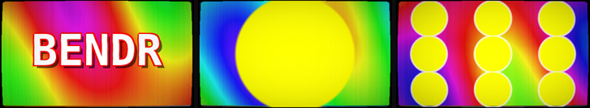

## What it is watched through

The output overlay is not a set of filters on the signal; it is everything between the picture and the eye, in the order light actually meets it. First the lens: barrel or pincushion distortion applied before anything is sampled, transverse chromatic aberration that grows towards the corners, and the horizontal anamorphic streak that a coated element throws off a highlight. Then the glass in front of the screen: smears that are only visible where something bright is behind them, reflections, dust, scratches, and light leaking past the felt to fog one side of the frame. Then the panel itself — an LCD subpixel lattice, and dead or stuck pixels that never move, which is what makes them read as a fault in the display rather than noise in the signal. There is a gate weave and a hair in the gate for the projector case.

Last, over everything, the deck's own display: a transport symbol, a tape counter that runs forward on play, seven times as fast on the shuttles and backwards on rewind, and an optional date stamp, in the dot-matrix yellow every camcorder used. It is drawn on a canvas rather than in the shader because it is type, and type wants a font.

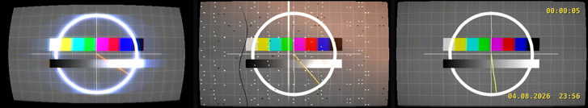

## Signal chain

The rail above the picture is the live signal path. **Drag the pills to reorder the stages, click one to bypass it.** Order changes everything: melting before the tape stage smears clean video and then damages it; melting after smears the damage itself.

```
per channel (A B C D):  INPUT → framing → FEEDBACK / RESCAN → frame store
                          → [ TAPE/SYNC · COLOUR/ENH · GLITCH LAB · SIGNAL LAB · FLOW/MOSH ]  ← reorderable
                  A + B:  → MIX BUS 1 ┐
                  C + D:  → MIX BUS 2 ┴→ MASTER MIX → MASTER OUTPUT → OVERLAY
```

- **Tape / sync** — a per-scanline PLL simulation runs on the CPU every frame, once per channel: correlated drift, loss-of-lock shear with exponential re-lock, a drifting tracking band, head-switch skew, AGC breathing, a rolling blanking bar when v-hold slips. Composite rot on top: chroma bleed and delay, directional luma bleed, vertical colour bleed, rainbow fringing, dot crawl, ringing, streaky bandwidth-limited noise, comet-tail dropouts.
- **Tape transport** — a whole deck per channel. The transport row drives that channel's source: still parks the noise bar a paused deck lays across the field, shuttle and jog scrub with head-crossing bands marching through the picture. Tape speed runs SP to EP, so the slower the tape the less bandwidth survives; generations compounds gen loss as if the tape had been dubbed that many times; track phase places the mistracking band and servo hunt sets the auto-tracking circuit searching for it. Then tape crease, head clog, azimuth error, scrape flutter, wow with its own rate, tape stretch, edge damage, print-through, chroma loss, hiss, and dropout with adjustable streak length.

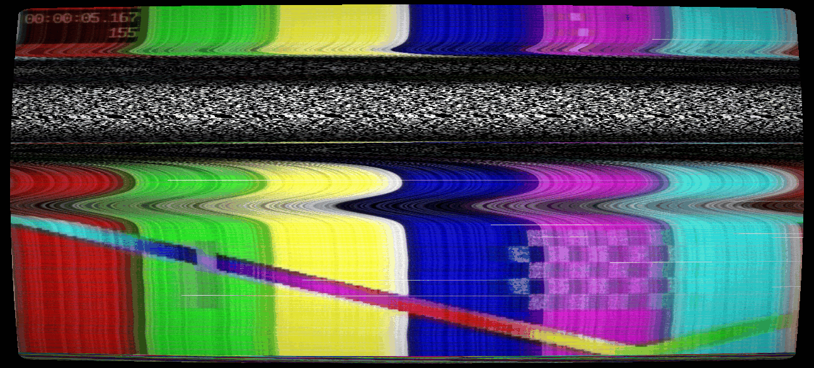
- **Mixer effects** — negative with three inversion modes, monocolour, colourpass (one hue survives, the rest goes monochrome), silhouette, find-edge, emboss, flip, mirror, multi-grid tiling, still, strobe and shake.
- **Colour / bent enhancer** — luma-keyed rainbow colorizer, a sharpness circuit driven into oscillating edge ghosts, RGB split, luma→hue slew, flickering inversion, per-channel RGB gain, posterize, solarize.
- **Contour / palette** — draws the isolines between brightness bands, giving the repeated outlines that trace a face or a body the way a bent enhancer does; plus FLATTEN to quantise brightness into solid poster-like colour fields, and DITHER to break the steps into speckle.
- **Kaleido** — folds the picture into radial symmetry; FOLD N = 3 gives triangles, and modulating FOLD SPIN rotates the whole composition.
- **CRT rephoto** — bloom, film-style halation, glass defocus and grain, for the look of a photograph *of* a screen rather than a clean render.
- **Glitch lab** — pixel sorting (bright runs stretch into streaks), macroblock databending, halftone dropout, channel-driven drift warp, FM contour warp.
- **Flow / mosh** — a temporal-smear stage with its own frame store, advected along a selectable vector field: real per-pixel optical flow estimated from the picture, brightness contours, curl noise, radial, spiral, chroma, weave. P-frame push drags the held frame along that field, which on the motion setting is what datamosh actually is — the picture stops updating while the movement keeps pulling it apart. Mosh gate restricts the holding to the moving parts of the frame or to the still parts; curl rotates the whole field so drift becomes orbit. Plus melt with its own angle and brightness gate, swirl with scale and speed, vector trash with block size and rate, stretch, edge repel, flow noise, per-pass hue and decay, re-sharpening, time shear on either axis, and clamp / repeat / mirror edges.
- **Feedback / rescan** — a full feedback rig: zoom, rotate, shear, offset and mirror in the loop, edge mode (clamp for tunnels, repeat for lattices, mirror for mandalas), per-pass colour rotation, saturation, value gain and per-channel RGB gain, chromatic displacement, blur plus sharpen (an activator–inhibitor pair that grows Turing patterns), a four-way non-linearity (clamp / soft / wrap / fold) with drive and pivot, threshold, loop noise, vertical roll, sync jitter and an auto-level servo. RESCAN: FULL feeds the display output back through the entire chain. Thirty presets prefixed **FB** are named after the looks they produce.
- **Signal lab** — sparse line jitter, NTSC crosstalk with separate artifact and fringing controls, shaped snow with clumping, FM wobble, slitscan, row smear, 1-bit crush with ordered dither, moiré, a multi-band sequential keyer, and field modulation that varies across the frame rather than per-frame.
- **Keyer** — luma or chroma key with a matte viewer; masks the glitch chain and/or the feedback.
- **Mixers** — three of them (bus 1, bus 2, master), each combining two fully-processed inputs: a fader plus twelve wipe patterns (H, V, diagonal, box, circle, splits, blinds, clock, bars, blocks) with soft edges and movable origin, key transitions, and add/difference/multiply/screen/lighten blends.
- **Preset morph** — snapshot two whole panel states and blend every slider between them.
- **Master output** — a display stage rather than a filter: seven display models (flat, aperture grille, slot mask, shadow mask, LCD stripe, mono monitor, green screen) with beam-profile scanlines that widen with brightness, phosphor persistence, HV sag, bloom, halation, defocus, grain, and a full output transform. Plus an overlay stage: letterbox and pillarbox mattes, bezel, glass glare, dust, scratches, screen moiré, rolling shutter and safe-area guides.

| 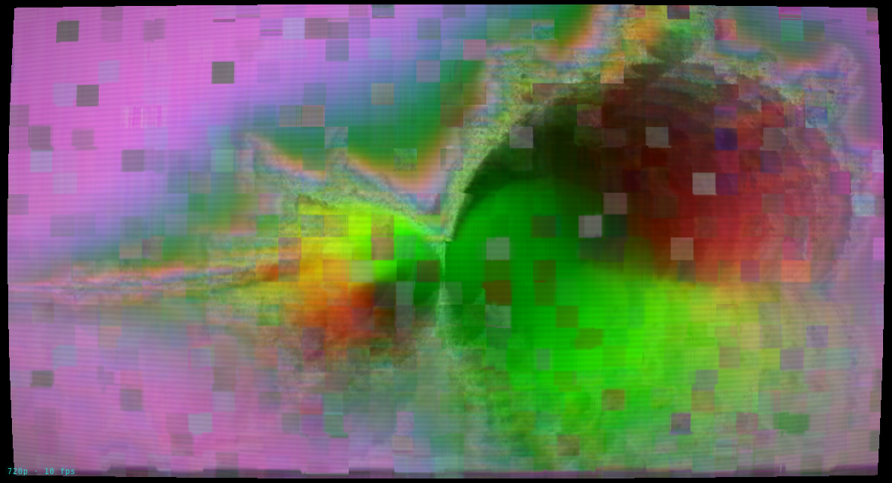 | 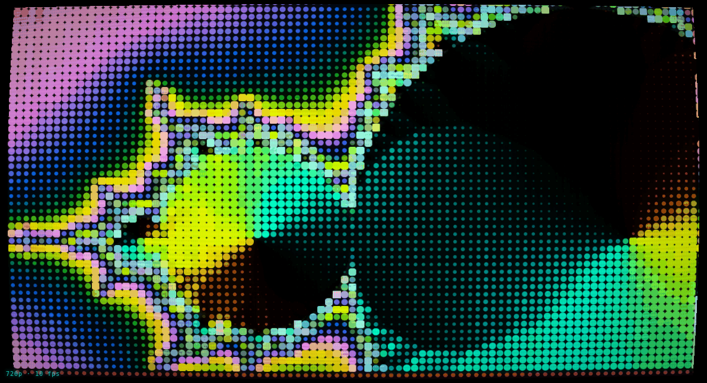 | 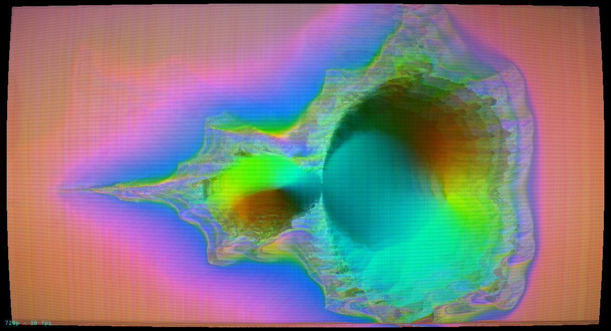 |
|---|---|---|
| DATAMOSH | DOT MATRIX | LIQUID MELT |

| 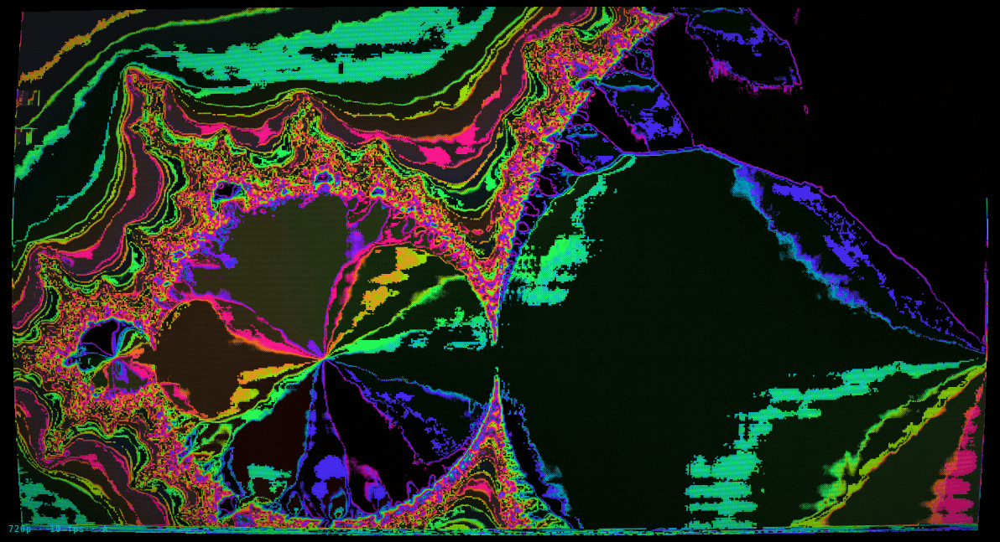 | 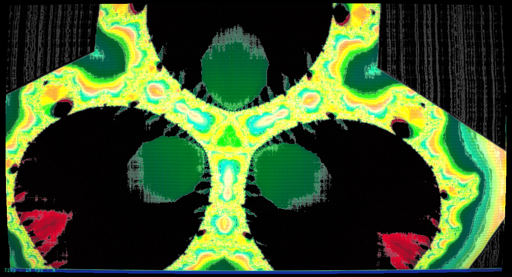 | 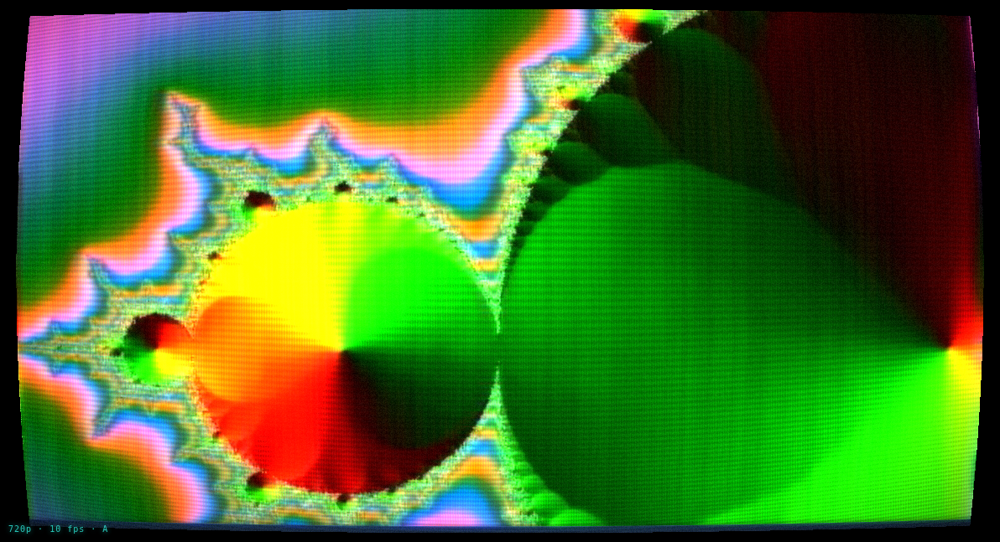 |
|---|---|---|
| VOL I — ENHANCER LINES | TRIANGLES | CRT REPHOTO |

Presets named after the glitch art series on [allmyfriendsarejpegs.com](https://allmyfriendsarejpegs.com): VOL I / II / III, TRIANGLES, 80S TRIANGLE, BLADE RUNNER TRIANGLE, CRT REPHOTO and JPEGS.

## Pattern synth

Any channel can be a generator rather than a player. It is built like a video synthesiser: coordinates go through a shape (scan, radial, spiral, plasma, lissajous, rings, starburst, grid, tunnel, cells, interference, polygon), then an oscillator with a selectable waveform, then cross-modulation between the axes, a wavefolder, a comparator, and a colouriser — mono, RGB phase, HSV sweep, duotone or hard bands. It runs entirely on the GPU and every control is a modulation destination, so patching an LFO into CROSS MOD turns it into a moving source with no file involved.

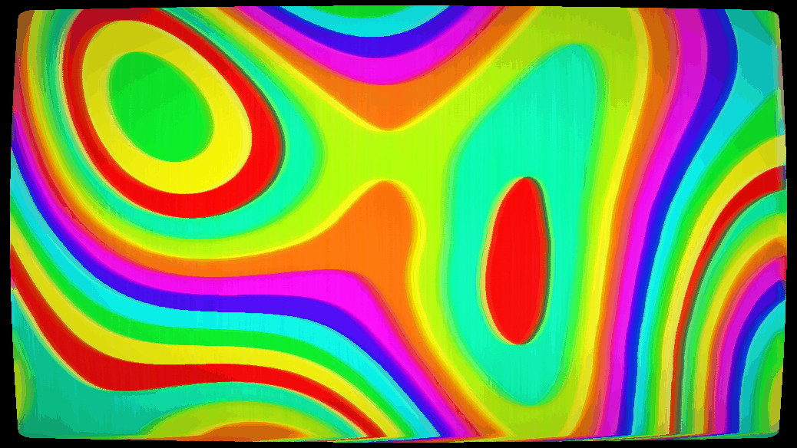

## Snapshots and the performance recorder

The dock under the picture has five tabs — mod matrix, modulation page, text editor, mix (the transition detail), and perform, which holds the snapshot bank, the recorder and the bend pads together. Eight snapshot slots hold the whole rig — all four channels, every bus, every mode — with a **glide** time. At zero a recall is a hard cut; wound up it becomes a slow transformation of everything at once.

The **performance recorder** writes down every control you move, twenty-four times a second, storing only what changed. It records gestures rather than pixels, so a take built slowly over an hour can be played back in real time, against completely different footage. Takes are saved inside the patch file.

## Text and shapes

Any channel can be a text/shape generator instead of a video source: type anything, choose from thirty-three fonts, set size, tracking, position, rotation, scroll and repeat, add an outline, and layer a shape underneath (circle, ring, rect, triangle, cross, bars, grid, concentric rings, starburst) with count, spin, stroke and pulse. It behaves exactly like any other source, so it can be glitched, fed back and mixed against video on the other channel.

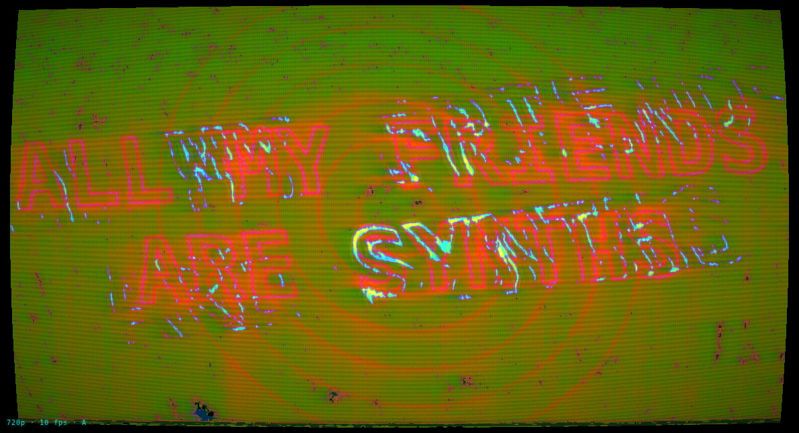

## Inputs

Each channel takes a video file (streamed from disk, so a 4GB file is no heavier than a small one), a camera, a screen, a generated pattern, the pattern synth, a text page, or re-entry from elsewhere in the rig.

**CAM** opens whatever is selected in the device list beside it, so a built-in webcam, a USB one, an HDMI capture stick and a virtual camera from streaming software all work the same way. Device names only appear once camera access has been granted, so the list reads DEVICE 1, DEVICE 2 until the first time CAM is pressed. **SCREEN** captures a screen, a window or a browser tab, which is the general way to bring in anything that is not a camera.

## Finding things, and not losing them

There are 349 parameters. Press `/` and type, and the panel narrows to whatever matches — the parameter's name, its section, or the body of its help text, so "roll" finds V ROLL and a phrase from a description finds the control it describes. Two chips beside the box answer the other two questions you have while playing: **MOVING** shows only what something is currently driving, and **CHANGED** shows only what you have moved off its default.

The six bend pads have their own strip beside the faders rather than living on a tab, because you should never have to go looking for them mid-set.

The patch, the eight snapshots and the current take are written to the browser every few seconds, so a reload, a crash or a flat battery picks up where you left off. Press `Z` straight after opening if you would rather start clean.

## Movement

Nothing sits still. The mod matrix patches any source into any parameter:

- As many modulators as you want, of three kinds: **LFOs** (ten shapes, free or synced to twenty divisions including dotted and triplet), **envelopes** (fire and decay on a bend pad, an audio onset, a scene cut or the tempo) and **macros** (one knob driving as many parameters as you point it at)
- Chaos, drift and spike generators
- Audio bands with adjustable frequency ranges, gain and response, listening to the loaded video's soundtrack, a live input (with device and channel selection for interfaces), or an audio file loaded and played on the AUDIO tab — which is how you build a piece against the track it will be shown with
- Video-reactive sources computed from the picture itself: motion, brightness, and scene-cut detection — patch CUT into TEAR and every edit knocks the sync loose

Every route has its own invert and response curve, so one source can push one parameter up while easing another down. The matrix links both ways: a route jumps to its modulator, and a modulator lists what it drives and jumps back. **Right-click any parameter** to patch a modulator onto it directly. The **MOD** page (`D`) draws every source live — four LFOs with editable rate, ten shapes and tempo sync, chaos/drift/spike generators, audio bands and video-reactive sources — and shows what each one is driving.

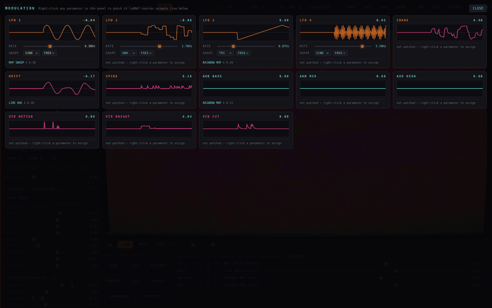

Presets you build yourself save to the machine and sit in the preset list beside the built-in ones; patches also save as `.json` files to move between machines.

Six momentary bend pads (mouse, `Q W E R T Y`, or MIDI notes C1–F1), MIDI CC learn on every slider, randomize/mutate with undo, per-section resets and a global init.

## Output

- Processing resolution from 360p to **4K**, independent of window size
- **FLUSH BUFFERS** empties every self-feeding buffer (feedback, flow, persistence, frame ring) without disturbing the patch
- Live **recording** with source audio, MP4 where the browser supports it and WebM otherwise
- Frame-accurate **offline MP4 render** via WebCodecs — every frame processed at full quality regardless of realtime performance (video only)
- PNG stills, fullscreen, and a clean **pop-out output window** for OBS capture or a second display

## Keys

`/` filter the panel · `Space` randomize · `M` mutate · `Z` undo · `shift`+`Z` redo · `1–9` presets · `shift`+`1–8` snapshots · `0` flush buffers · `Q W E R T Y` hold bends · `B` bypass · `V` multiview · `F` fullscreen · `S` still · `shift`+`R` record · `P` play/pause · `D` mod page · `H` help

`0` is the panic key: it empties every buffer that feeds itself — the feedback store, the flow stage, the phosphor persistence and the frame ring — without touching a single control. That is the way out when a bad frame gets caught circulating.

## Development

Source lives in `src/` as ten parts plus a vendored MP4 muxer. They are concatenated, in order, into a single `<script>`, which is what lets a later part use a `const` from an earlier one with no imports, no bundler and no module loader — and is why the file still runs from `file://` with the network off.

| part | what is in it |
|---|---|
| `p1_shell.html` | markup, all the CSS, the help overlay |
| `p20_shaders.js` | GLSL source strings, nothing else |
| `p21_params.js` | section table, parameter registry, get/set |
| `p22_help.js` | per-parameter and per-section help text |
| `p23_gl.js` | context, programs, render targets, uniforms |
| `p3_mod_ui.js` | modulation engine, audio, panel and dock construction |
| `p40_presets.js` | presets, state capture and restore, undo |
| `p41_sources.js` | file, camera, screen, pattern, text, synth, re-entry |
| `p42_capture.js` | recording, stills, multiview, snapshots, performance recorder |
| `p43_render.js` | sync model, render loop, deck display |
| `p44_offline.js` | offline MP4 render, MIDI, keyboard, init |

Build the single-file `index.html` with:

```
python3 build.py
```

The build syntax-checks the concatenated script, prints the gzipped size and a hash, fails on a size budget, and prints where each part landed so a line number in a stack trace can be resolved by eye.

`test/e2e-example.js` shows how the app is exercised headlessly with Playwright. Note that the canvas is created without `preserveDrawingBuffer`, so reading a frame back has to happen inside the frame callback: `await page.evaluate(() => window.__grab())` returns a data URL captured at the right moment.

## License

MIT.
